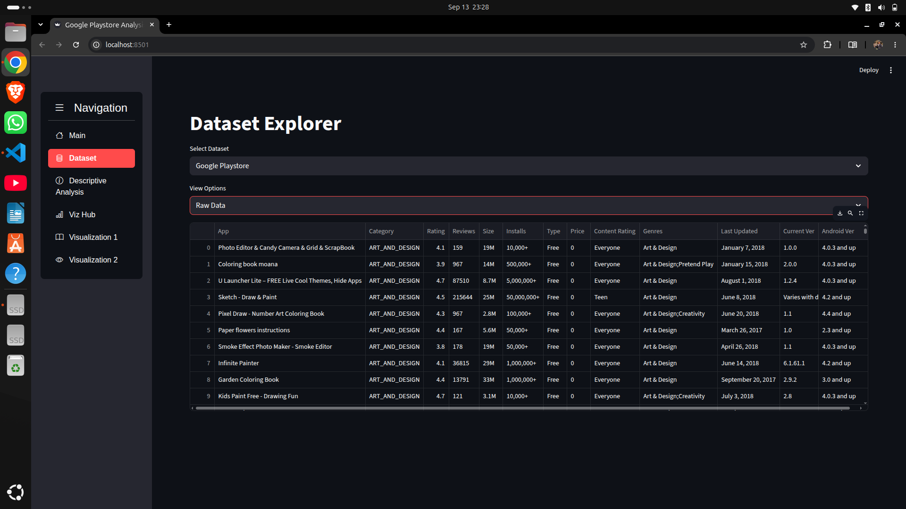
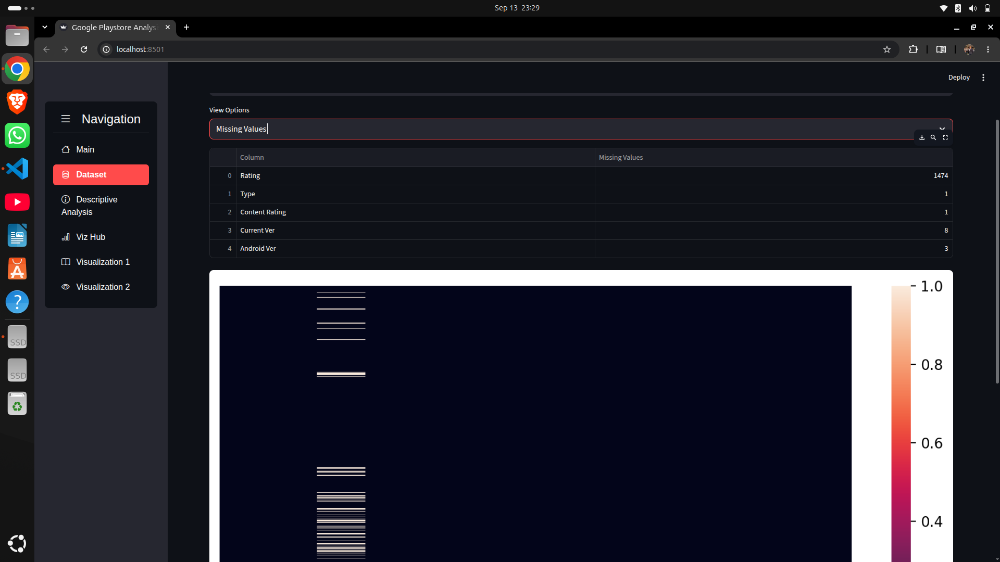
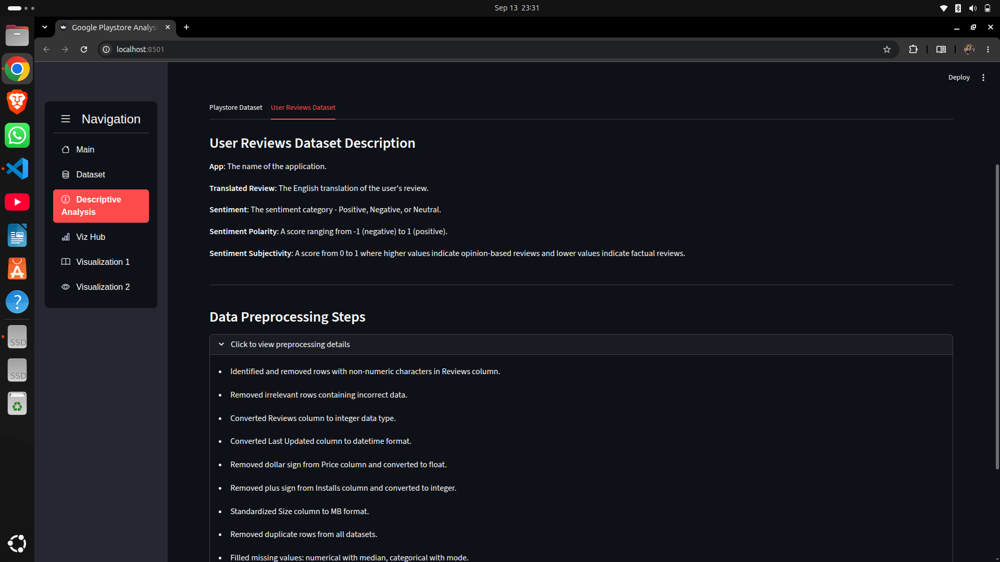
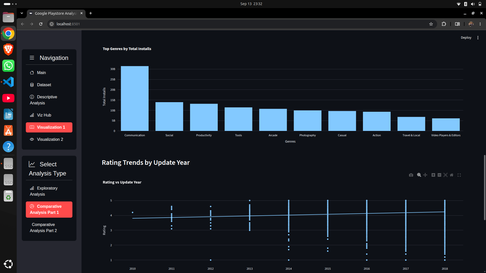
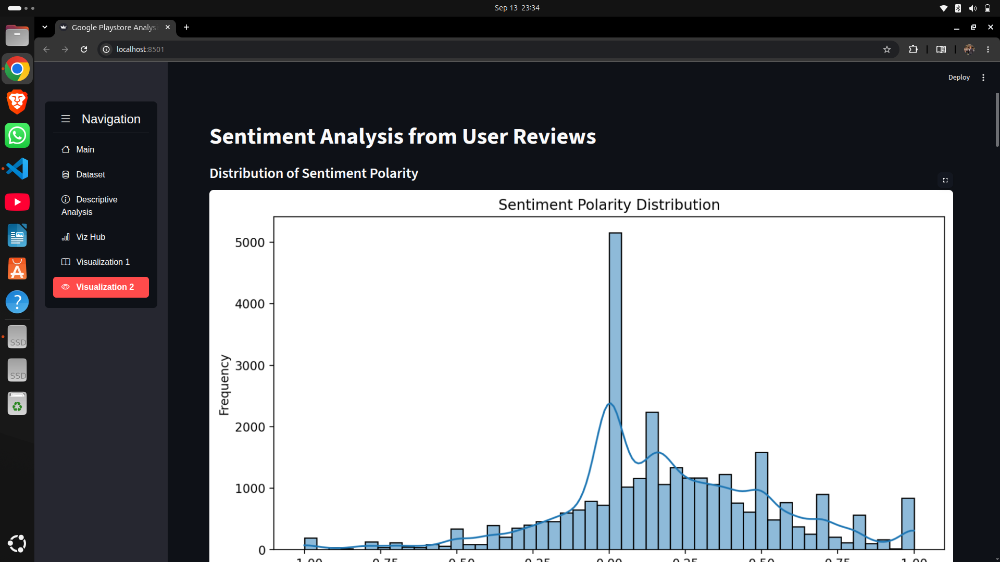
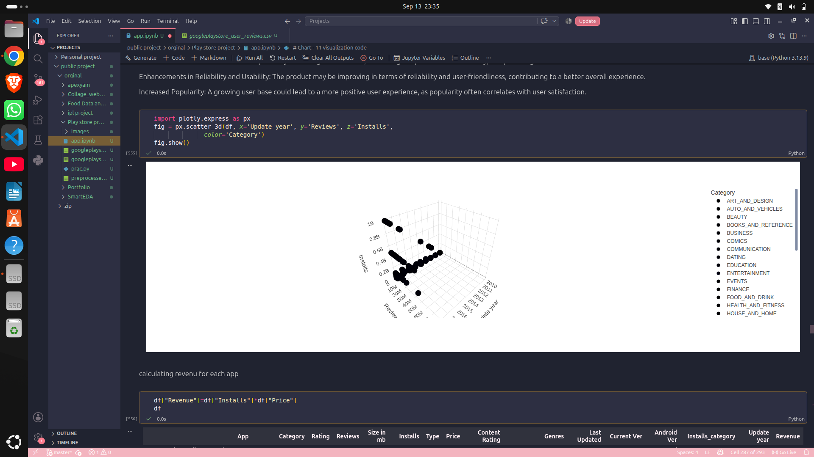

# Google Play Store Data Analysis

This project is an analysis of Google Play Store applications and user reviews. I built it to explore how different applications perform on the Play Store and to understand what the data can tell us about ratings, reviews, installs, pricing, categories, and user sentiment.

The project started with cleaning and understanding the raw datasets and was then developed into an interactive Streamlit dashboard where the analysis can be explored visually.

## About the Project

The Google Play Store dataset contains information about thousands of applications, but the raw data is not immediately ready for analysis. It contains missing values, duplicate records, inconsistent formats, and columns that need to be converted before they can be used properly.

I first worked on cleaning and preparing the data and then used it to investigate questions such as:

* Which categories contain the most applications?
* How are ratings distributed?
* Is there a relationship between reviews and installs?
* How do free and paid applications compare?
* Which categories and genres have higher install numbers?
* How does application revenue vary between categories?
* What are users saying about the applications they use?
* How does sentiment differ between application categories?

The final analysis is presented through a Streamlit dashboard.

## Dashboard

The dashboard brings the different parts of the project together, from the original datasets and preprocessing to the final visualizations and sentiment analysis.

### Home


## Dataset

The project uses two datasets.

### Google Play Store Dataset

The main dataset contains information about applications available on the Google Play Store.

Some of the main columns are:

```text
App
Category
Rating
Reviews
Size
Installs
Type
Price
Content Rating
Genres
Last Updated
Current Ver
Android Ver
```

The original dataset contains 10,841 application records.




### User Reviews Dataset

The second dataset contains reviews written by users along with sentiment information.

The main columns are:

```text
App
Translated_Review
Sentiment
Sentiment_Polarity
Sentiment_Subjectivity
```


## Data Cleaning and Preprocessing

A significant part of the project was preparing the raw Play Store dataset for analysis.

The following steps were performed:

* checked the structure and data types of the dataset
* identified missing values
* removed invalid values from the `Reviews` column
* converted review counts into numeric values
* cleaned the `Installs` column
* converted install values into numeric format
* removed currency symbols from `Price`
* converted prices into numeric values
* converted application sizes into MB
* converted `Last Updated` into a datetime format
* removed duplicate records
* handled missing numerical values
* handled missing categorical values
* identified extreme values
* removed outliers using percentile-based filtering
* created additional columns needed for the analysis

Some derived variables were created to make the analysis easier, including:

* Update Year
* Installs Category
* Revenue

### Missing Values



### Data Types


### Preprocessed Dataset


## Descriptive Analysis

Before comparing applications, I looked at the basic characteristics of the cleaned dataset.

This part of the analysis covers:

* ratings
* reviews
* installs
* application categories
* application types
* prices
* application sizes
* numerical distributions




## Exploratory Analysis

The exploratory analysis focuses on understanding the overall structure of applications on the Play Store.

The visualizations cover things such as:

* application rating distribution
* numerical feature distributions
* number of applications in each category
* reviews compared with installs
* free and paid applications
* installs by application type
* genres with the highest installs
* rating trends over time

### Visualization Dashboard


### Exploratory Visualizations


## Comparative Analysis

After looking at individual variables, I compared different groups of applications to see how their performance differs.

The analysis includes:

* free applications vs paid applications
* highest-rated free applications
* highest-rated paid applications
* most-reviewed free applications
* average revenue by category
* revenue vs installs
* installs by application type
* top genres by installs
* rating trends by update year




## Sentiment Analysis

The user reviews dataset adds another side to the analysis.

Ratings and installs show how an application performs numerically, but reviews give some idea of how users actually feel about it.

The sentiment analysis uses:

* `Sentiment`
* `Sentiment_Polarity`
* `Sentiment_Subjectivity`

The analysis looks at:

* positive, neutral, and negative reviews
* sentiment polarity
* sentiment across application categories
* polarity and subjectivity
* relationships between sentiment and application characteristics

### Sentiment Polarity



### Sentiment by Category


### Sentiment Subjectivity


## Technology Used

| Technology            | Used For                       |
| --------------------- | ------------------------------ |
| Python                | Data processing and analysis   |
| Pandas                | Data cleaning and manipulation |
| Matplotlib            | Visualization                  |
| Seaborn               | Statistical visualization      |
| Plotly                | Interactive charts             |
| Streamlit             | Dashboard                      |
| Streamlit Option Menu | Navigation                     |
| Streamlit Lottie      | Dashboard interface            |
| Jupyter Notebook      | Exploratory analysis           |

## Project Structure

```text
Play store project/
│
├── prac.py
├── app.ipynb
│
├── googleplaystore.csv
├── googleplaystore_user_reviews.csv
├── preprocessed_GPS.csv
│
├── README.md
│
└── images/
    ├── home.png
    ├── Dataset1.png
    ├── Dataset2.png
    ├── Dataset3.png
    ├── Dataset4.png
    ├── Dataset 5.png
    ├── Dataset6.png
    ├── Description1.png
    ├── Description2.png
    ├── VIzualitaion_main.png
    ├── Visulaization1-1.png
    ├── Visulaizationn1-2.png
    ├── VIsulizationn1-3.png
    ├── VIsulaization2-1.png
    ├── Visualization2-2.png
    ├── Visulaizationn2-3.png
    ├── Codingpart1.png
    ├── Coding  part 2.png
    ├── Coding part3.png
    └── Coding part 4.png
```

## Running the Project

### Clone the repository

```bash
git clone <https://github.com/Sai-Satyam0/Google-Play-Store-analysis>
cd "Play store project"
```

### Install the required libraries

```bash
pip install pandas matplotlib seaborn plotly streamlit streamlit-option-menu streamlit-lottie statsmodels
```

### Run the dashboard

```bash
streamlit run prac.py
```

Once Streamlit starts, open the local address shown in the terminal.

## Code

The project also contains the Python code used to perform the preprocessing, analysis, and visualization.

### Data Preprocessing



### Analysis


### Visualization


### Chart Generation


## What This Project Covers

This project brings together several parts of data analysis:

* data cleaning
* missing-value handling
* duplicate removal
* outlier handling
* data transformation
* feature creation
* exploratory data analysis
* comparative analysis
* statistical relationships
* data visualization
* sentiment analysis
* interactive dashboard development

## Future Improvements

There are several directions in which the project could be extended:

* add more interactive filters to the dashboard
* add KPI cards for important application metrics
* improve the dashboard layout
* perform more advanced NLP on user reviews
* build an application recommendation system
* add deeper revenue analysis
* deploy the dashboard online
* allow the dataset to be updated automatically

## Author

**Sai Satyam Biswal**

Data Analytics | Python | Data Visualization | Streamlit
